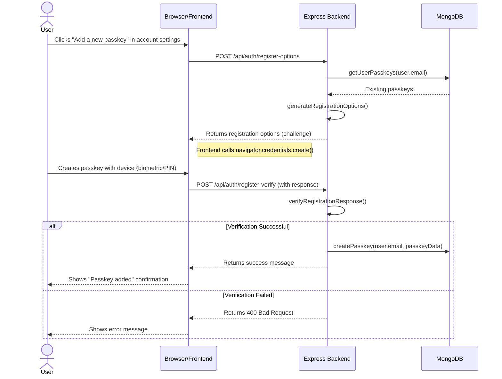

## Adding a Passkey to an Existing Account

This diagram shows how a user can add a new passkey to their account.

```mermaid
sequenceDiagram
    actor User
    participant Frontend as Browser/Frontend
    participant Backend as Express Backend
    participant DB as MongoDB

    User->>Frontend: Clicks "Add a new passkey" in account settings
    Frontend->>Backend: POST /api/auth/register-options
    Backend->>DB: getUserPasskeys(user.email)
    DB-->>Backend: Existing passkeys
    Backend->>Backend: generateRegistrationOptions()
    Backend-->>Frontend: Returns registration options (challenge)
    Note right of Frontend: Frontend calls navigator.credentials.create()
    User->>Frontend: Creates passkey with device (biometric/PIN)
    Frontend->>Backend: POST /api/auth/register-verify (with response)
    Backend->>Backend: verifyRegistrationResponse()
    alt Verification Successful
        Backend->>DB: createPasskey(user.email, passkeyData)
        Backend-->>Frontend: Returns success message
        Frontend-->>User: Shows "Passkey added" confirmation
    else Verification Failed
        Backend-->>Frontend: Returns 400 Bad Request
        Frontend-->>User: Shows error message
    end
```
