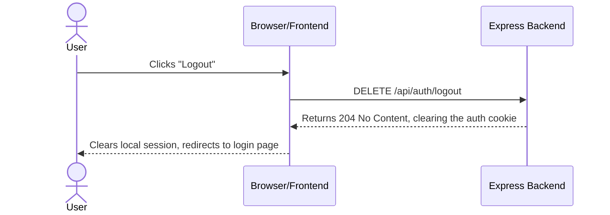

## Logout

This diagram shows the sequence of events when a user logs out.

```mermaid
sequenceDiagram
    actor User
    participant Frontend as Browser/Frontend
    participant Backend as Express Backend

    User->>Frontend: Clicks "Logout"
    Frontend->>Backend: DELETE /api/auth/logout
    Backend-->>Frontend: Returns 204 No Content, clearing the auth cookie
    Frontend-->>User: Clears local session, redirects to login page
```
