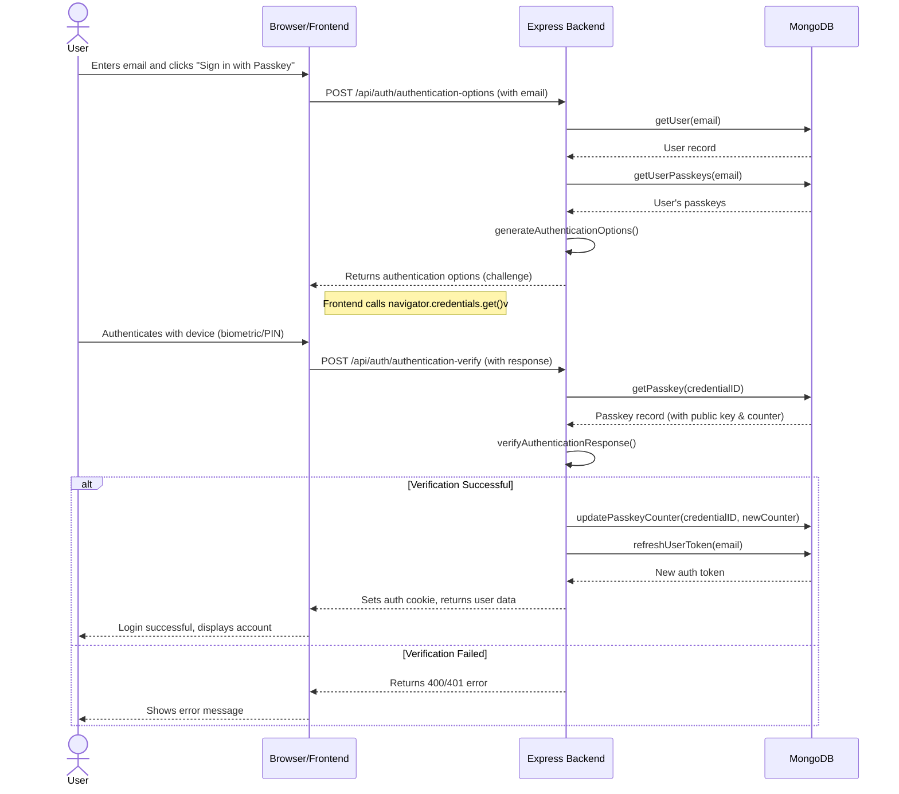

## Passkey Login Sequence

This diagram shows the sequence of events when a user logs in with a passkey.

```mermaid
sequenceDiagram
    actor User
    participant Frontend as Browser/Frontend
    participant Backend as Express Backend
    participant DB as MongoDB

    User->>Frontend: Enters email and clicks "Sign in with Passkey"
    Frontend->>Backend: POST /api/auth/authentication-options (with email)
    Backend->>DB: getUser(email)
    DB-->>Backend: User record
    Backend->>DB: getUserPasskeys(email)
    DB-->>Backend: User's passkeys
    Backend->>Backend: generateAuthenticationOptions()
    Backend-->>Frontend: Returns authentication options (challenge)
    Note right of Frontend: Frontend calls navigator.credentials.get()v
    User->>Frontend: Authenticates with device (biometric/PIN)
    Frontend->>Backend: POST /api/auth/authentication-verify (with response)
    Backend->>DB: getPasskey(credentialID)
    DB-->>Backend: Passkey record (with public key & counter)
    Backend->>Backend: verifyAuthenticationResponse()
    alt Verification Successful
        Backend->>DB: updatePasskeyCounter(credentialID, newCounter)
        Backend->>DB: refreshUserToken(email)
        DB-->>Backend: New auth token
        Backend-->>Frontend: Sets auth cookie, returns user data
        Frontend-->>User: Login successful, displays account
    else Verification Failed
        Backend-->>Frontend: Returns 400/401 error
        Frontend-->>User: Shows error message
    end
```
