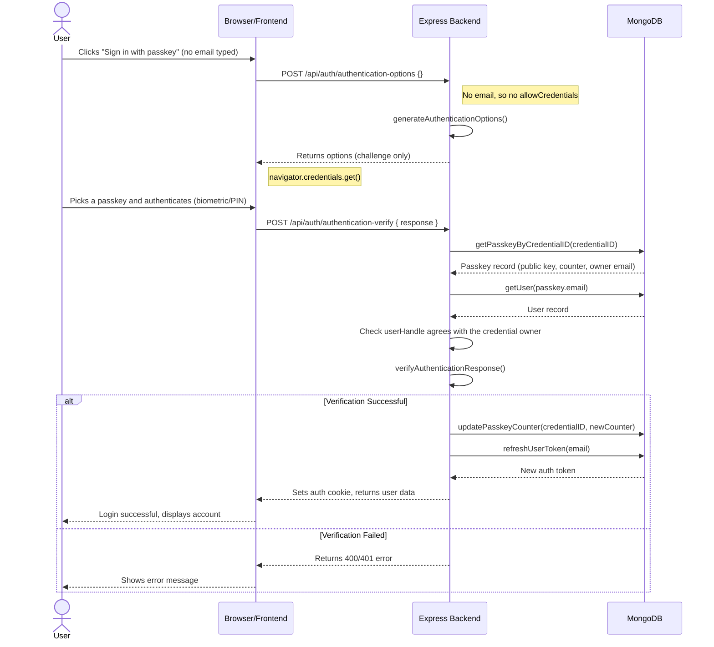

## Passkey Login Sequence

Passkeys registered here are **discoverable credentials** (resident keys), so
signing in needs nothing but the passkey. The email field is optional and only
narrows the ceremony.

The account is identified from the credential itself: the browser returns a
credential ID, and the server finds the passkey — and therefore the account —
from that.

### Two ways in, both without an email

- **The button.** "Sign in with passkey" starts the ceremony immediately and the
  authenticator shows its own account chooser.
- **Autofill (conditional UI).** On page load the browser is offered the same
  ceremony, so passkeys appear in the email field's autofill menu alongside
  saved usernames. This needs `autocomplete="username webauthn"` on that field.
  If the browser cannot do it, nothing is shown and nothing is reported.

### If an email *is* typed

The ceremony is narrowed to that account's credentials via `allowCredentials`,
and an unknown email still returns 404. This keeps any older, non-discoverable
passkey usable.

### Registration

`residentKey: 'required'` is what makes a credential discoverable, and it is
requested both at sign-up and when adding a passkey. A few older security keys
cannot store discoverable credentials; `RESIDENT_KEY=preferred` lets them
register anyway, at the cost of needing an email to sign in with that key.

### Why the user handle is checked

A discoverable assertion may carry a user handle, which registration sets to the
account's email bytes. The server rejects an assertion whose handle names a
different account than the credential is filed under, so a credential cannot be
used to sign in as somebody else.
