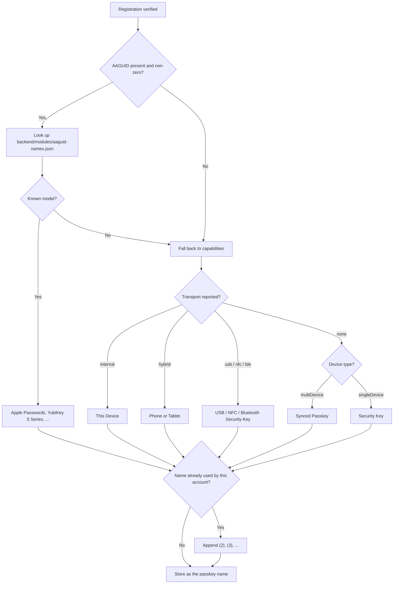

## Naming a Passkey After Its Authenticator

The account page shows "Apple Passwords" or "YubiKey 5 Series" rather than a raw
base64url credential ID. The name comes from the AAGUID, a 16-byte identifier
for the authenticator model carried in the authenticator data.

### Attestation is what makes this work

When the relying party asks for `attestation: 'none'`, browsers deliberately
replace the AAGUID with sixteen zero bytes so that relying parties cannot
fingerprint the user's hardware. Every passkey then reports the same null
AAGUID and only the capability-based fallback names remain.

`ATTESTATION` therefore controls how specific these names can be:

| Setting | Naming | Notes |
|---|---|---|
| `direct` (default) | Real model names | The authenticator identifies its model. |
| `none` | Capability-based only | The privacy-preserving setting assumed by the proxy experiments in this repo. |

The name is only a label. Users can rename any passkey, and renaming is itself
a reauthentication-gated operation.
