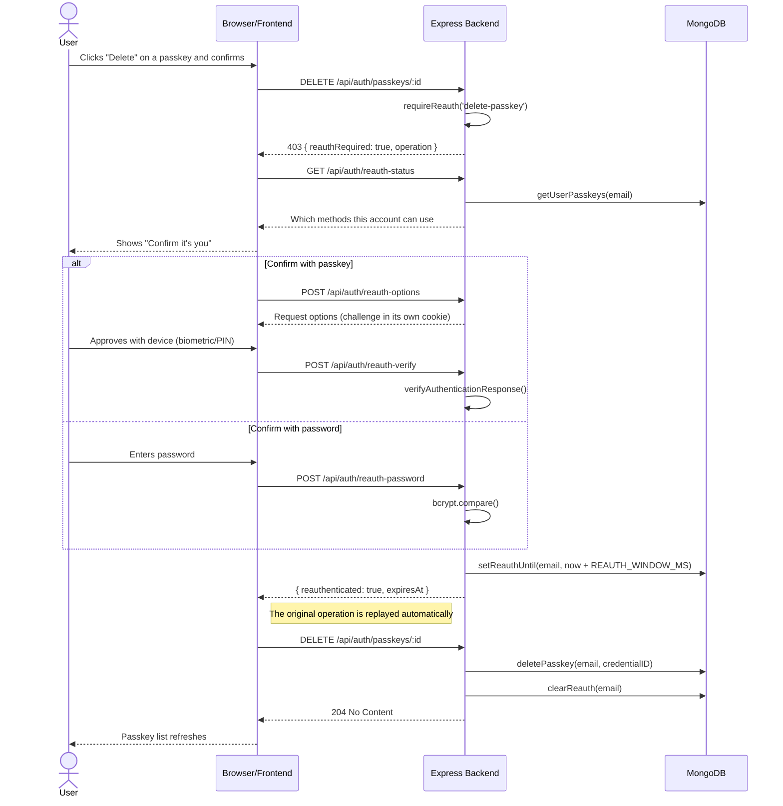

## Reauthentication

Being signed in is not enough to manage credentials. Adding, renaming or
deleting a passkey, changing the password and deleting the account each require
the user to prove who they are again. This is the treatment under study.

The server decides when a prompt is needed, so the browser never has to know the
policy: it simply retries the operation once reauthentication succeeds.

### Window semantics

- A successful reauthentication opens a window of `REAUTH_WINDOW_MS`
  (default five minutes).
- Completing one sensitive operation closes the window again, so each operation
  costs one reauthentication.
- An operation that **fails** does not close the window. A user whose delete was
  rejected should not have to prove who they are twice.
- Reauthenticating with a passkey does **not** rotate the session token, unlike
  signing in. Rotating it would invalidate the cookie of the session the user is
  currently using.

### Study switches

| Variable | Effect |
|---|---|
| `REAUTH_REQUIRED=false` | Control condition: no reauthentication at all. |
| `REAUTH_OPERATIONS` | Comma-separated subset to gate. Unset means all of them. |
| `REAUTH_WINDOW_MS` | How long a successful reauthentication stays valid. |

Operation names: `add-passkey`, `delete-passkey`, `rename-passkey`,
`delete-account`, `change-password`.
