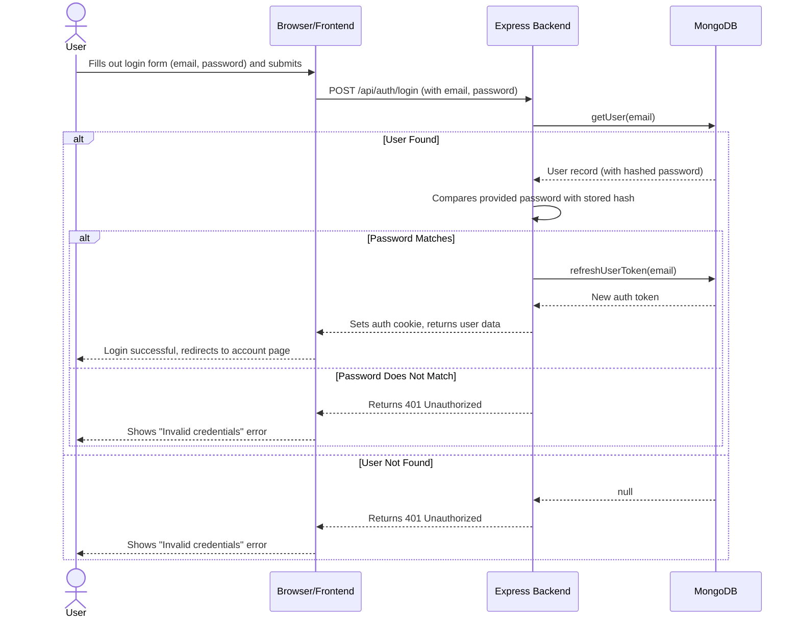

## User Login (with password)

This diagram shows the sequence of events when a user logs in with a password.

```mermaid
sequenceDiagram
    actor User
    participant Frontend as Browser/Frontend
    participant Backend as Express Backend
    participant DB as MongoDB

    User->>Frontend: Fills out login form (email, password) and submits
    Frontend->>Backend: POST /api/auth/login (with email, password)
    Backend->>DB: getUser(email)
    alt User Found
        DB-->>Backend: User record (with hashed password)
        Backend->>Backend: Compares provided password with stored hash
        alt Password Matches
            Backend->>DB: refreshUserToken(email)
            DB-->>Backend: New auth token
            Backend-->>Frontend: Sets auth cookie, returns user data
            Frontend-->>User: Login successful, redirects to account page
        else Password Does Not Match
            Backend-->>Frontend: Returns 401 Unauthorized
            Frontend-->>User: Shows "Invalid credentials" error
        end
    else User Not Found
        DB-->>Backend: null
        Backend-->>Frontend: Returns 401 Unauthorized
        Frontend-->>User: Shows "Invalid credentials" error
    end
```