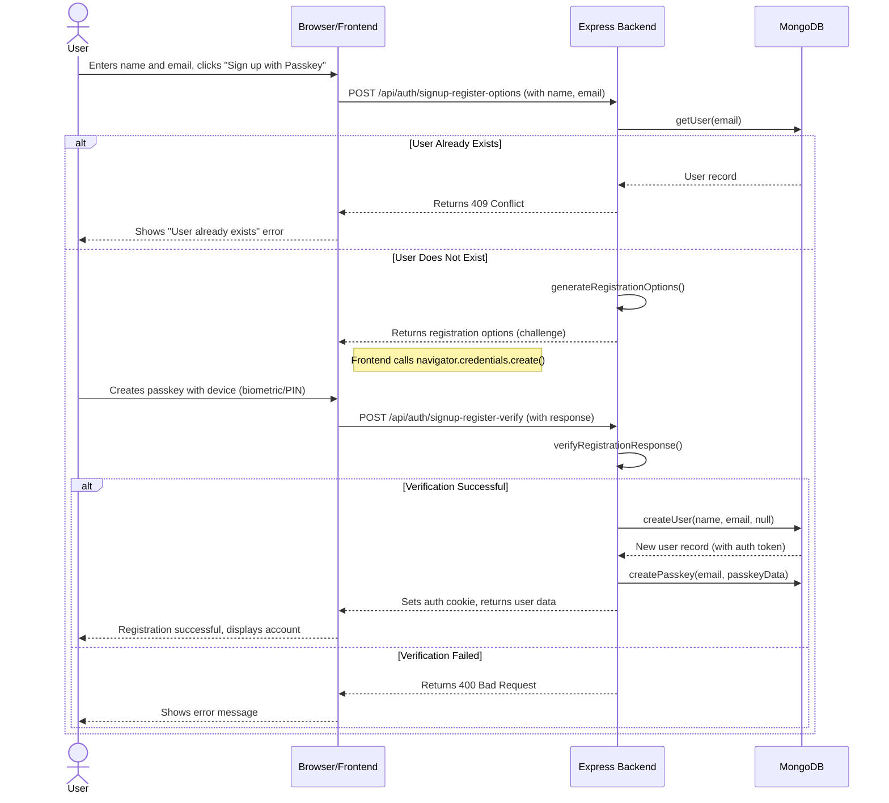

## User Registration (with passkey)

This diagram shows the sequence of events when a new user signs up with a passkey.

```mermaid
sequenceDiagram
    actor User
    participant Frontend as Browser/Frontend
    participant Backend as Express Backend
    participant DB as MongoDB

    User->>Frontend: Enters name and email, clicks "Sign up with Passkey"
    Frontend->>Backend: POST /api/auth/signup-register-options (with name, email)
    Backend->>DB: getUser(email)
    alt User Already Exists
        DB-->>Backend: User record
        Backend-->>Frontend: Returns 409 Conflict
        Frontend-->>User: Shows "User already exists" error
    else User Does Not Exist
        Backend->>Backend: generateRegistrationOptions()
        Backend-->>Frontend: Returns registration options (challenge)
        Note right of Frontend: Frontend calls navigator.credentials.create()
        User->>Frontend: Creates passkey with device (biometric/PIN)
        Frontend->>Backend: POST /api/auth/signup-register-verify (with response)
        Backend->>Backend: verifyRegistrationResponse()
        alt Verification Successful
            Backend->>DB: createUser(name, email, null)
            DB-->>Backend: New user record (with auth token)
            Backend->>DB: createPasskey(email, passkeyData)
            Backend-->>Frontend: Sets auth cookie, returns user data
            Frontend-->>User: Registration successful, displays account
        else Verification Failed
            Backend-->>Frontend: Returns 400 Bad Request
            Frontend-->>User: Shows error message
        end
    end
```