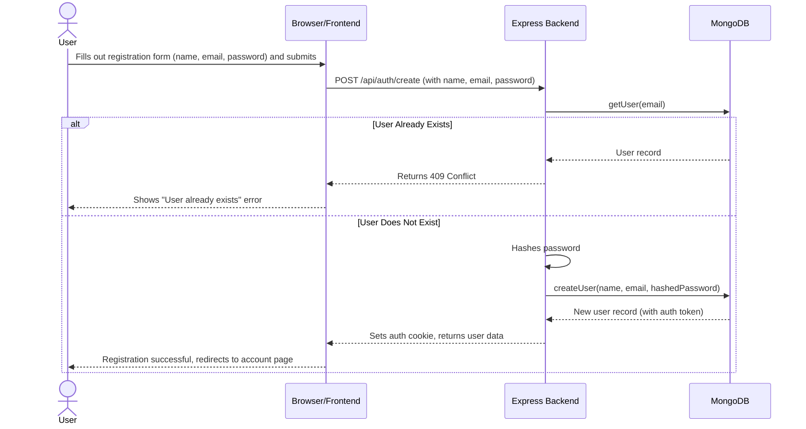

## User Registration (with password)

This diagram shows the sequence of events when a new user signs up with a password.

```mermaid
sequenceDiagram
    actor User
    participant Frontend as Browser/Frontend
    participant Backend as Express Backend
    participant DB as MongoDB

    User->>Frontend: Fills out registration form (name, email, password) and submits
    Frontend->>Backend: POST /api/auth/create (with name, email, password)
    Backend->>DB: getUser(email)
    alt User Already Exists
        DB-->>Backend: User record
        Backend-->>Frontend: Returns 409 Conflict
        Frontend-->>User: Shows "User already exists" error
    else User Does Not Exist
        Backend->>Backend: Hashes password
        Backend->>DB: createUser(name, email, hashedPassword)
        DB-->>Backend: New user record (with auth token)
        Backend-->>Frontend: Sets auth cookie, returns user data
        Frontend-->>User: Registration successful, redirects to account page
    end
```